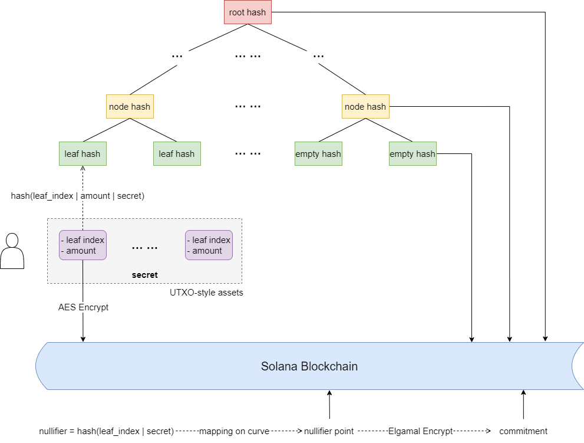
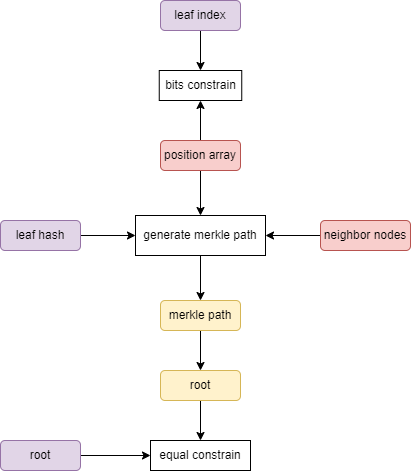
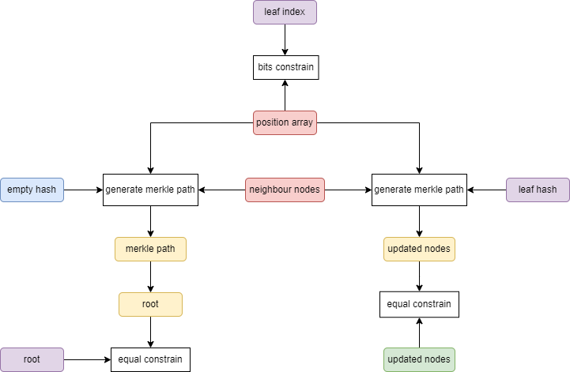
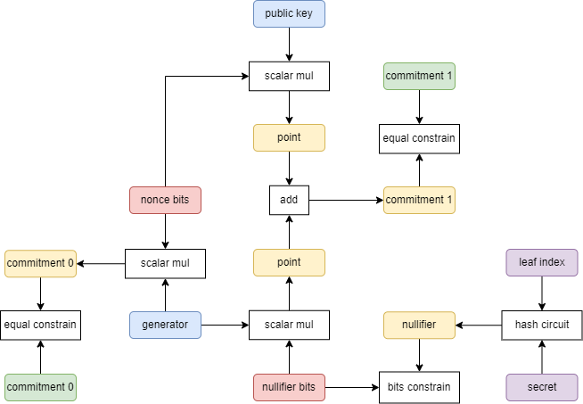
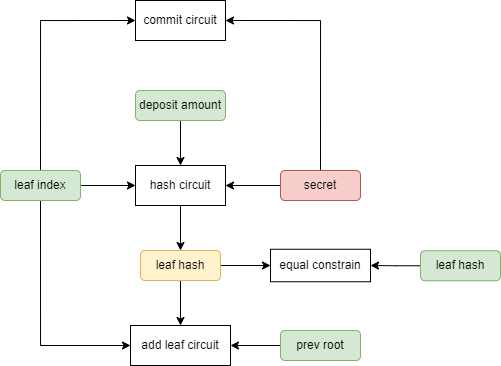
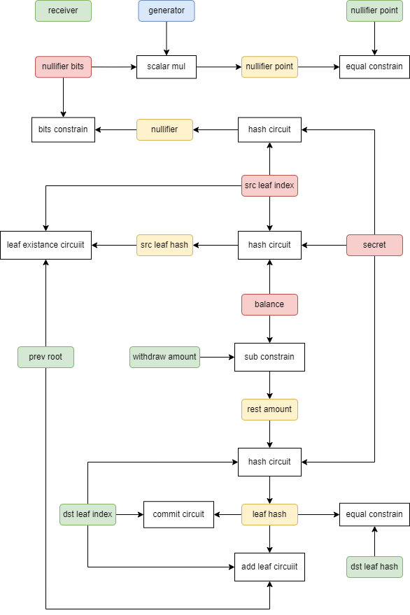

# Soda Maze Spec

Soda Maze is a coins mixing protocol with supporting arbitrary amount deposit/withdraw and auditable designing.

## Data Structure

### Off chain

- User use a `secret` derived from private key as an identity in Soda Maze.

### On chain

- Users' assets are constructed as UTXO-style format and stored on chain after encrypted with `secret` by AES.
- All Users' assets will be hashed and organized as a Balanced Binary Merkle Tree on chain.
- Leaves hashes and nodes hashes are all stored on chain.
- The tree is initialized with leaves equaled to empty hash.
- A withdrawed UTXO-style asset will be computed as a `nullifier` and stored on chain to avoid double spending.
- The `nullifier` corresponding to a UTXO-style asset will be encrypted as a `commitment` with viewing public key by Elgamal and stored on chain, in case of revealing the `commitment` to `nullifier` with the viewing private key for compliance audit in special circumstances, like money laudering by hackers.

## Circuits

### Variables

We assumpts variables types as following:

### Leaf Existance Circuit

*Prove the leaf node exists in Merkle Tree.*

- **position array** is the bits expression of **leaf index**.
- Use **leaf hash**, **position array**, **neighbor nodes** to generate merkle path.
- The last element in generated merkle path should equal to the input **root**.

### Add Leaf Circuit

*There are 2 ways to prove replacing an empty leaf hash with a new leaf hash in Merkle Tree:*
*1. Provide all neighbour nodes and root hash as public inputs. Compute the updated merkle path with the new leaf hash.*
*2. Provide all neighbour nodes as witness variables, leaf index and root as public inputs. Compute the merkle path with the empty hash and neighbour nodes, check if the root hash is matched or not. Finally compute the updated merkle path with the new leaf hash.*
*Obviously, the 2nd way requires much less public inputs, which is more friendly to construct a transaction on chain.*

- **position array** is the bits expression of **leaf index**.
- Use **empty hash**, **position array**, **neighbor nodes** to generate merkle path.
- The last element in generated merkle path should equals to the input **root**.
- Use **leaf hash**, **position array**, **neighbor nodes** to generate new merkle path.
- The input **updated nodes** should equal to generated merkle path in order.

### Commit Circuit

*Commit is a process that encrypt the nullifier to commitment with viewing public key by Elgamal Algorithm.*

- Compute **nullifier** = hash(**leaf index** | **secret**)
- Convert **nullifier** to **nullifier bits**, truncate **nullifier bits** to satisfy Jubjub scalar field.
- Scalar multiply **nonce bits** with generator, get **commitment 0**.
- Scalar multiply **nullifier bits** with generator, scalar multiply **nonce bits** with **public key**, sum together and get **commitment 1**.
- The pair of **commitment 0** and **commitment 1** is commitment.

### Deposit Circuit

*A commitment is a reserved field to reveal the nullifier in special circumstances, which is equivalent to assets flowing direction.*
*Hash asset to leaf and insert in Merkle Tree, then compute commitment.*

- **leaf index** is current index of the next available empty leaf captured from blockchain.
- Compute **leaf hash** = hash(**leaf index** | **deposit amount** | **secret**).
- Use `Add Leaf Circuit` with **leaf index**, **leaf hash** and **prev root**.
- Use `Commit Circuit` with **leaf index** and **secret**.

### Withdraw Circuit

*Prove the withdrawing asset exists in Merkle Tree and compute nullifier, hash rest asset and insert back into Merkle Tree as UTXO style, then compute commitment.*

- User needs to find out **src leaf index** and **balance**, which are source asset infos to withdraw from.
- Compute **src leaf hash** = hash(**src leaf index** | **balance** | **secret**).
- Use `Leaf Existance Circuit` with **src leaf index**, **src leaf hash** and **prev root**.
- Compute **nullifier** = hash(**leaf index** | **secret**)
- Convert **nullifier** to **nullifier bits**, truncate **nullifier bits** to satisfy Jubjub scalar field.
- Scalar multiply **nullifier bits** with generator, get **nullifier point**.
- Compute **rest amount** = **balance** - **withdraw amount**.
- Compute **dst leaf hash** = hash(**dst leaf index** | **rest amount** | **secret**).
- Use `Add Leaf Circuit` with **dst leaf index**, **dst leaf hash** and **prev root**.
- Use `Commit Circuit` with **dst leaf index** and **secret**.
